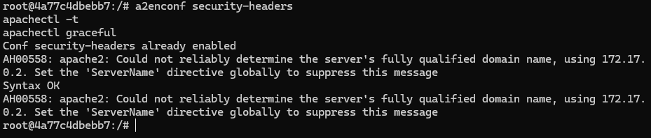
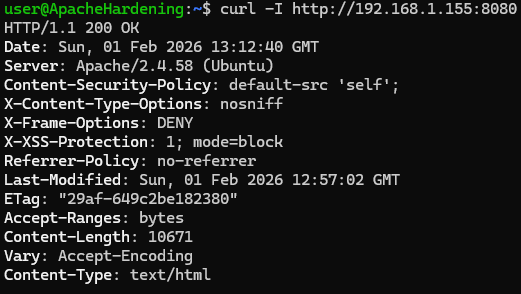

# RA 3.1.1 – CSP

El objetivo del **CSP (Content Security Policy)** es reducir riesgos como la carga de recursos externos maliciosos o inyecciones de código, indicando al navegador **qué está permitido cargar** y qué no.

## Configuración de cabeceras de seguridad

Creamos un archivo de configuración específico para las cabeceras de seguridad:

- `nano /etc/apache2/conf-available/security-headers.conf`

Añadimos el siguiente contenido:

````
Header always set Content-Security-Policy "default-src 'self';"
Header always set X-Content-Type-Options "nosniff"
Header always set X-Frame-Options "DENY"
Header always set X-XSS-Protection "1; mode=block"
Header always set Referrer-Policy "no-referrer"
````


**Explicación breve:**
- **Content-Security-Policy**: Solo permite cargar recursos desde el propio servidor.
- **X-Content-Type-Options**: Evita que el navegador intente interpretar archivos como otro tipo distinto.
- **X-Frame-Options**: Impide que la web se cargue dentro de un iframe (protección contra clickjacking).
- **X-XSS-Protection**: Activa el filtro básico contra ataques XSS en el navegador.
- **Referrer-Policy**: Evita que se envíe información de la URL al navegar a otros sitios.


## Activación de la configuración

Activamos el archivo de configuración y comprobamos que no haya errores:

- `a2enconf security-headers`
- `apachectl -t`
- `apachectl graceful`



## Validación del CSP

Comprobamos que las cabeceras se estén enviando correctamente:

- `curl -I http://<IP>:8080`

Deberemos obtener una respuesta similar a:

````
HTTP/1.1 200 OK
Date: Sun, 01 Feb 2026 13:12:40 GMT
Server: Apache/2.4.58 (Ubuntu)
Content-Security-Policy: default-src 'self';
X-Content-Type-Options: nosniff
X-Frame-Options: DENY
X-XSS-Protection: 1; mode=block
Referrer-Policy: no-referrer
Last-Modified: Sun, 01 Feb 2026 12:57:02 GMT
ETag: "29af-649c2be182380"
Accept-Ranges: bytes
Content-Length: 10671
Vary: Accept-Encoding
Content-Type: text/html
````



# Recursos

## Docker

- [Dockerfile.pr2](https://hub.docker.com/repository/docker/pps10830341/ra3.1/tags/pr2/sha256:111e30a15219b07c468dc81903f17b2623441dc8ef18866bf22c25c471211ad4) (**sha256:** 111e30a15219b07c468dc81903f17b2623441dc8ef18866bf22c25c471211ad4)