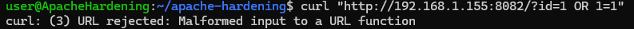

# RA 3.1.1 – WAF

Un **WAF (Web Application Firewall)** permite detectar y bloquear ataques comunes contra aplicaciones web, como inyecciones SQL o intentos de manipulación de URLs.

## Instalación de ModSecurity

Ejecutamos los siguientes comandos:

- `apt update`
- `apt install -y software-properties-common`
- `add-apt-repository universe`
- `apt update`
- `apt install -y libapache2-mod-security2`
- `apt clean`
- `rm -rf /var/lib/apt/lists/*`

Estos pasos instalan el módulo **ModSecurity** y limpian archivos innecesarios para reducir el tamaño del sistema.

## Activación del motor de reglas

Copiamos la configuración recomendada y activamos el modo de bloqueo real:

- `cp /etc/modsecurity/modsecurity.conf-recommended /etc/modsecurity/modsecurity.conf`
- `sed -i 's/SecRuleEngine DetectionOnly/SecRuleEngine On/' /etc/modsecurity/modsecurity.conf`
- `a2enmod security2`

Con esto, ModSecurity pasa de solo detectar ataques a **bloquearlos activamente**.

## Comprobación de funcionamiento

Probamos una inyección SQL simulada:

- `curl "http://<IP>:8082/?id=1 OR 1=1"`

Si el WAF funciona correctamente, devolverá errores como:

````
curl: (3) URL rejected: Malformed input to a URL function 
````
o
````
403 Forbidden
````



# Recursos

## Docker

- [Dockerfile.pr3](https://hub.docker.com/repository/docker/pps10830341/ra3.1/tags/pr3/sha256:8a7495755249f58a18d7f453e49301b4779ab01f06dd97ca2091e1da45b61d9e) (**sha256:** 8a7495755249f58a18d7f453e49301b4779ab01f06dd97ca2091e1da45b61d9e)