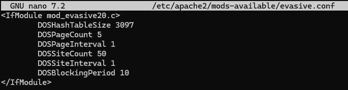

# RA 3.1.1 – DDoS

Para mitigar ataques de denegación de servicio se utiliza el módulo **mod_evasive**, que limita peticiones repetitivas desde una misma IP.

## Instalación del módulo

- `apt update`
- `apt install -y libapache2-mod-evasive`

## Configuración básica

Editamos el archivo de configuración:

- `nano /etc/apache2/mods-available/evasive.conf`

Añadimos o modificamos el contenido:

````
<IfModule mod_evasive20.c>
        DOSHashTableSize 3097
        DOSPageCount 5
        DOSPageInterval 1
        DOSSiteCount 50
        DOSSiteInterval 1
        DOSBlockingPeriod 10
</IfModule>
````

**Resumen del comportamiento:**
- **Limita accesos repetitivos a la misma página.**
- **Bloquea temporalmente la IP que genera demasiadas peticiones.**
- **Reduce el impacto de ataques automatizados.**



# Recursos

## Docker

- [Dockerfile.pr4](https://hub.docker.com/repository/docker/pps10830341/ra3.1/tags/pr4/sha256:09e5b499ff5ec5cd4bc99b926415f238b517f7c59055493838af48f1bdd72b7a) (**sha256:** 09e5b499ff5ec5cd4bc99b926415f238b517f7c59055493838af48f1bdd72b7a)