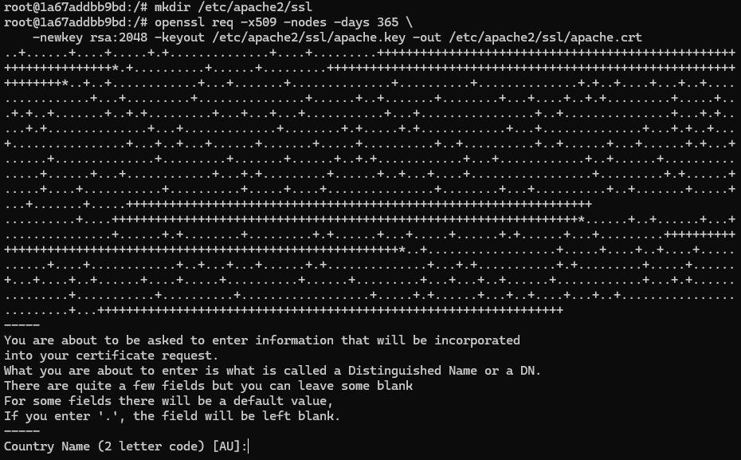
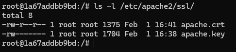
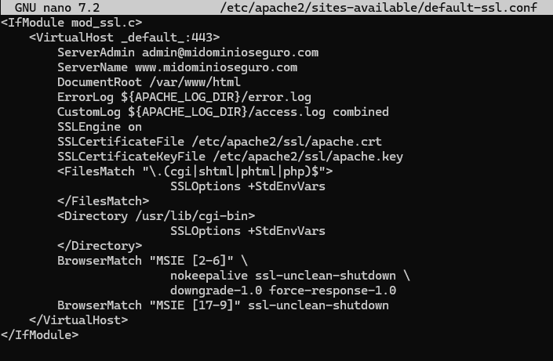

# RA 3.1.2 – Certificado SSL

El uso de **HTTPS** protege la comunicación entre cliente y servidor mediante cifrado, evitando la interceptación de datos.

## Activación de SSL y generación del certificado

Ejecutamos:

- `a2enmod ssl`
- `service apache2 reload`
- `mkdir /etc/apache2/ssl`

Generamos un certificado autofirmado:

- `openssl req -x509 -nodes -days 365 \
  -newkey rsa:2048 \
  -keyout /etc/apache2/ssl/apache.key \
  -out /etc/apache2/ssl/apache.crt`



## Comprobación del certificado

- `ls -l /etc/apache2/ssl/`



## Configuración del sitio SSL

Editamos el archivo:

- `nano /etc/apache2/sites-available/default-ssl.conf`

Configuramos el certificado:

````
<IfModule mod_ssl.c>
    <VirtualHost _default_:443>
        ServerAdmin admin@midominioseguro.com
        ServerName www.midominioseguro.com
        DocumentRoot /var/www/html
        ErrorLog ${APACHE_LOG_DIR}/error.log
        CustomLog ${APACHE_LOG_DIR}/access.log combined
        SSLEngine on
        SSLCertificateFile /etc/apache2/ssl/apache.crt
        SSLCertificateKeyFile /etc/apache2/ssl/apache.key
        <FilesMatch "\.(cgi|shtml|phtml|php)$">
                        SSLOptions +StdEnvVars
        </FilesMatch>
        <Directory /usr/lib/cgi-bin>
                        SSLOptions +StdEnvVars
        </Directory>
        BrowserMatch "MSIE [2-6]" \
                        nokeepalive ssl-unclean-shutdown \
                        downgrade-1.0 force-response-1.0
        BrowserMatch "MSIE [17-9]" ssl-unclean-shutdown
    </VirtualHost>
</IfModule>
````



## Activación del sitio HTTPS

- `a2ensite default-ssl.conf`
- `service apache2 reload`

# Recursos

## Docker

- [Dockerfile.pr5](https://hub.docker.com/repository/docker/pps10830341/ra3.1/tags/pr5/sha256:277263aa59085921691578bbf79bb96f103482aa840f9e7955c29e0760cbe256) (**sha256:** 277263aa59085921691578bbf79bb96f103482aa840f9e7955c29e0760cbe256)

## Guías

- [P1-SSL.html](https://psegarrac.github.io/Ciberseguridad-PePS/tema1/practicas/2020/11/08/P1-SSL.html)