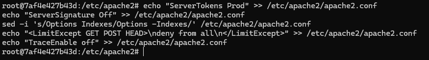

# RA 3.1.3 – Buenas Prácticas de Seguridad en Apache

Estas medidas reducen la información expuesta por el servidor y limitan métodos HTTP innecesarios.

## Aplicación de buenas prácticas

Ejecutamos:

- `echo "ServerTokens Prod" >> /etc/apache2/apache2.conf`
- `echo "ServerSignature Off" >> /etc/apache2/apache2.conf`

Evitan mostrar la versión exacta de Apache.

- `sed -i 's/Options Indexes/Options -Indexes/' /etc/apache2/apache2.conf`

Desactiva el listado de archivos en directorios.

- `echo "<LimitExcept GET POST HEAD>
deny from all
</LimitExcept>" >> /etc/apache2/apache2.conf`

Restringe métodos HTTP potencialmente peligrosos.

- `echo "TraceEnable off" >> /etc/apache2/apache2.conf`

Desactiva el método TRACE para evitar ataques de tipo Cross-Site Tracing.

# Recursos

## Docker

- [Dockerfile.pr6](https://hub.docker.com/repository/docker/pps10830341/ra3.1/tags/pr6/sha256:eb553510c0386a5817f2583146d92998a983644192251a85e769fc067d83adfe) (**sha256:** eb553510c0386a5817f2583146d92998a983644192251a85e769fc067d83adfe)

## Guías

- [apache-web-server-hardening-security](https://geekflare.com/cybersecurity/apache-web-server-hardening-security/)